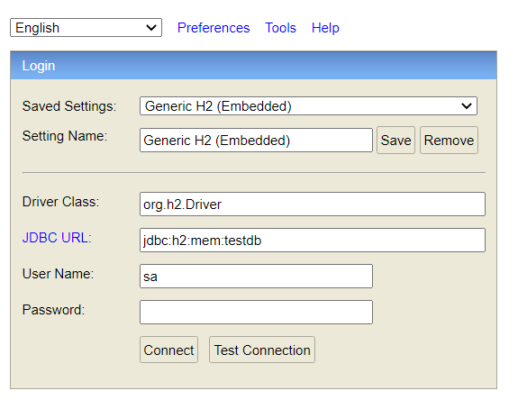

# READ ME

## PROJECT DESCRIPTION

An example of an e-mobility charging solutions platform, the service provide a REST API that is
capable of managing Charge Detail Records (CDR) in real time to a network of Charge Point Operators
(CPO).

In order to achieve that goal, a CDR contract and a set of endpoints are required as follows:

### Charge Detail Record fields

• Session identification

• Vehicle identification

• Start time

• End time

• Total cost

### Endpoints

• Create a Charge Detail Record

    • The "End time" cannot be smaller than "Start time"

    • The "Start time" of an upcoming Charge Detail Record for a particular vehicle must always be bigger than the "End time" of any previous Charge Detail Records.

    • The "Total cost" must be greater than 0

• Get a Charge Detail Record by id

• Search all Charge Detail Records for a particular vehicle

    • All fields must be sortable

## DATABASE

When the service start you can use the link http://localhost:8080/h2-console
with following info to access H2 in memory DB

The DB is created and fill at each start based on files **CDR_DDL.sql** and **CDR_DML.sql** in
resources folder

## SWAGGER-UI

http://localhost:8080/swagger-ui/index.html

## DOCKER

The project can be easily deployed using Docker Compose, as it consists of three Docker images:

• Spring Boot application

• Prometheus

• Grafana

Simply run the following command to start the project: **docker compose up**

This will start all the necessary containers and services for your project.

## PROJECT HOSTING

### GitHub Repository and Workflow

This project is hosted on GitHub. You can find the repository at [https://github.com/ZuhirL/SpringBoot](https://github.com/ZuhirL/SpringBoot).

### Live Deployment

The project is also hosted on Render at [https://spring-boot-xwj7.onrender.com/swagger-ui.html](https://spring-boot-xwj7.onrender.com/swagger-ui.html). 

Please note that this deployment may experience occasional downtime due to limitations of the free hosting tier.

In the event of downtime, please be patient as the platform will automatically redeploy the application. 
This ensures that you can access the application as soon as it becomes available again. 

### GitHub Workflow

It's established a GitHub Actions workflow to automate various tasks, such as building, testing, and deploying the project. You can view the workflow configuration and status by navigating to the "Actions" tab on the GitHub repository.
